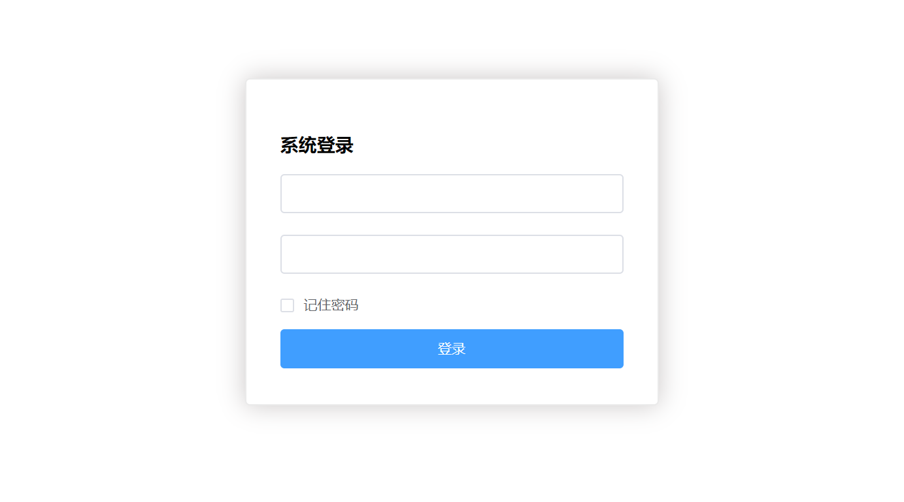
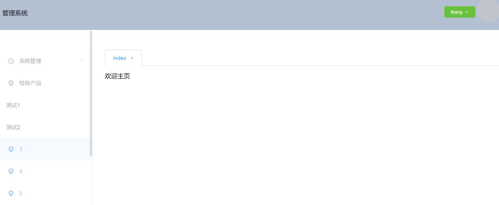
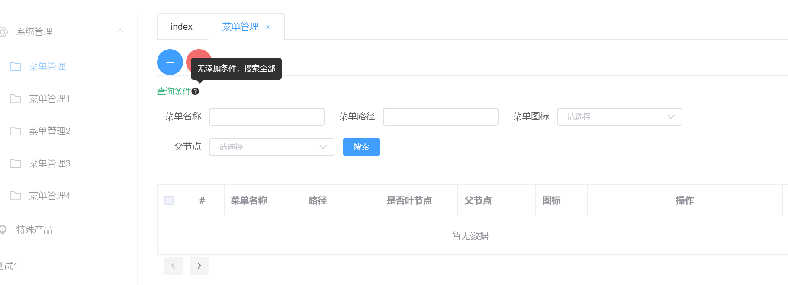

#项目介绍和需求

## 1 前端

    前端采用vue js框架 elementui ui框架 ，组件模块化开发。
    
    前端进度会以图片方式在此记录。根据后端进度，完善优化功能

 

### 前端图片记录
#### 2019-07-23
   

   

   
    
## 2 后端

    后端采用springboot mybatis mysql 尽量靠近restfulapi风格的接口数据项目

## 数据模型

## 请求路径

### 3 v0.1版

    现本项目只有springboot mybatis提供基础的数据的功能
    项目分controller，service，dao层
    请求
    get
    post，接受参数为json格式，数据传输json

​    
​    
​    